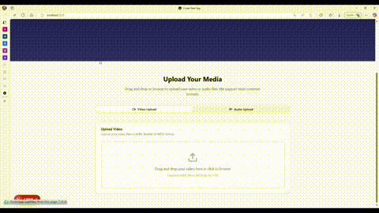

# SubLingua-AI: Multilingual Subtitle Generation System  
SubLingua-AI is a multilingual, context-aware subtitle generation system that supports **50+ languages** and detects **500+ non-verbal acoustic events** (e.g., laughter, applause, music cues, beeps, sirens). It features a **Flask** backend and a **JavaScript/TypeScript** frontend, with a pluggable ASR layer powered by **OpenAI**, **AssemblyAI**, or **Whisper**. SubLingua-AI delivers accurate, time-aligned captions and sound annotations in formats like **SRT** and **VTT**.

---
## 🎥 Demo Results

  
  

---

## ⚙️ Features  

- **Multilingual support** (50+ languages)  
- **Non-verbal audio detection** (music, laughter, applause, etc.)  
- **Upload & preprocess pipeline** (via Flask API)  
- **Automatic subtitle generation** with configurable output types (`.srt`, `.vtt`)  
- **Frontend + Backend integration** for an end-to-end experience  

---

## 🚀 Tech Stack  

- **Backend**: Python, Flask, Flask-CORS, Werkzeug, Logging  
- **Frontend**: JavaScript / TypeScript (npm framework)  
- **Audio/Video Processing**: FFmpeg (external dependency)  
- **Modeling**: OpenAI API, whisper AI & ML models for subtitle + non-verbal sound recognition  

---
